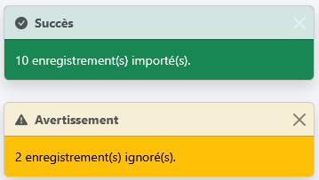

# Exemples JS — Xalise

## XalHttp — Mock des appels API

Simule un appel HTTP avec un délai configurable et une réponse fictive,
tout en déclenchant les mêmes indicateurs visuels que `XalHttp.fetch()`.

**Signature :**

```js
XalHttp.mock(
    data,
    { delay, fail },
    { placeholder, toast, overlay, onSuccess, onError }
)
```

| Paramètre | Type | Défaut | Description |
|---|---|---|---|
| `data` | `*` | `null` | Données fictives retournées par la promesse |
| `delay` | `number` | `5000` | Délai en ms avant la résolution |
| `fail` | `boolean` | `false` | Si `true`, simule une erreur réseau |
| `placeholder` | `string` | — | Sélecteur CSS de la zone placeholder |
| `toast` | `string` | — | Message du toast de chargement |
| `overlay` | `boolean` | `false` | Si `true`, affiche l'overlay sans message |
| `overlay` | `string` | — | Si `string`, affiche l'overlay avec ce message |
| `onSuccess` | `Function` | — | Callback appelé en cas de succès. Reçoit les données en paramètre |
| `onError` | `Function` | — | Callback appelé en cas d'erreur. Reçoit l'erreur en paramètre. Si absent, un toast d'erreur est affiché |

---

### Succès avec délai par défaut (5s)

```js
XalHttp.mock({ items: [], total: 0 });
```

---

### Succès avec placeholder et délai personnalisé

```js
XalHttp.mock(
    [{ id: 1, nom: 'Dupont' }, { id: 2, nom: 'Martin' }],
    { delay: 10000 },
    { placeholder: '#tooltip-div' }
);
```


---

### Simulation d'erreur réseau

```js
XalHttp.mock(null, { fail: true })
       .catch(err => console.error(err.message));
```

---

### Simulation d'une opération longue avec toast

Le toast est affiché dans le coin inférieur droit de la page.

```js
XalHttp.mock(
    { url: '/exports/rapport-2026.pdf' },
    { delay: 20000 },
    { toast: 'Génération du PDF en cours…' }
);
```


---

### Overlay bloquant toute interaction avec la page

```js
// Sans message
XalHttp.mock(
    { url: '/exports/rapport-2026.pdf' },
    { delay: 20000 },
    { overlay: true }
);
```

```js
// Avec message
XalHttp.mock(
    { url: '/exports/rapport-2026.pdf' },
    { delay: 20000 },
    { overlay: 'Génération du PDF en cours…' }
);
```


---

### Mise à jour du message de l'overlay en cours d'opération

```js
XalHttp.mock(
    { url: '/exports/rapport-2026.pdf' },
    { delay: 20000 },
    {
        overlay: 'Initialisation…',
        onSuccess: (data) => {
            XalLoaderOverlay.updateMessage('Finalisation…');
        }
    }
);
```

---

### Callbacks onSuccess et onError

```js
// Traitement complet des données en cas de succès
XalHttp.mock(
    { items: [{ id: 1, nom: 'Dupont' }], total: 1 },
    { delay: 2000 },
    {
        placeholder: '#xal-id-table-fournisseurs',
        onSuccess: (data) => {
            renderTable(data.items);
            document.querySelector('#xal-id-counter').textContent = data.total;
            XalToast.success(`${data.total} fournisseur(s) chargé(s).`);
        },
        onError: (error) => {
            console.error('[Mock] Erreur :', error.message);
            XalToast.error('Erreur lors du chargement des fournisseurs.');
        },
    }
);
```

```js
// Gestion différenciée des codes d'erreur HTTP
XalHttp.fetch('/api/fournisseurs/42', { method: 'DELETE' }, {
    overlay: 'Suppression en cours…',
    onSuccess: () => {
        XalToast.success('Fournisseur supprimé avec succès.');
    },
    onError: (error) => {
        if (error instanceof Response) {
            switch (error.status) {
                case 403:
                    XalToast.error('Vous n\'avez pas les droits pour effectuer cette action.');
                    break;
                case 404:
                    XalToast.error('Ce fournisseur n\'existe plus.');
                    break;
                case 409:
                    XalToast.warning('Ce fournisseur est lié à des commandes existantes.');
                    break;
                default:
                    XalToast.error(`Erreur ${error.status} : ${error.statusText}`);
            }
        } else {
            XalToast.error('Connexion impossible. Vérifiez votre réseau.');
        }

        console.error('[XalHttp] Erreur lors de la suppression :', error);
    },
});
```

---

## XalHttp — Appels API réels

Enveloppe `fetch()` natif avec la gestion automatique des indicateurs
visuels de chargement et la gestion des erreurs HTTP.

**Signature :**

```js
XalHttp.fetch(
    url,
    fetchOptions,
    { placeholder, toast, overlay, onSuccess, onError }
)
```

| Paramètre | Type | Défaut | Description |
|---|---|---|---|
| `url` | `string` | — | URL de la ressource |
| `fetchOptions` | `Object` | `{}` | Options passées à `fetch()` (`method`, `headers`, `body`, etc.) |
| `placeholder` | `string` | — | Sélecteur CSS de la zone placeholder |
| `toast` | `string` | — | Message du toast de chargement |
| `overlay` | `boolean` | `false` | Si `true`, affiche l'overlay sans message |
| `overlay` | `string` | — | Si `string`, affiche l'overlay avec ce message |
| `onSuccess` | `Function` | — | Callback appelé après une réponse HTTP réussie. Reçoit la `Response` en paramètre |
| `onError` | `Function` | — | Callback appelé en cas d'erreur réseau ou HTTP. Reçoit la `Response` (erreur HTTP) ou une `Error` (erreur réseau) en paramètre. Si absent, un toast d'erreur est affiché |

---

### GET — chargement d'une liste

```js
XalHttp.fetch('/api/fournisseurs', {}, {
    placeholder: '#xal-id-table-fournisseurs',
    onSuccess: (response) => {
        response.json().then(data => {
            renderTable(data.items);
            document.querySelector('#xal-id-counter').textContent = data.total;
        });
    },
});
```

---

### GET — chargement avec paramètres de recherche

```js
const params = new URLSearchParams({ search: 'dupont', page: 1, limit: 20 });

XalHttp.fetch(`/api/fournisseurs?${params}`, {}, {
    onSuccess: (response) => {
        response.json().then(data => renderTable(data.items));
    },
});
```

---

### POST — création d'un enregistrement

```js
XalHttp.fetch('/api/fournisseurs', {
    method:  'POST',
    headers: { 'Content-Type': 'application/json' },
    body:    JSON.stringify({ nom: 'Dupont', siret: '12345678900000' }),
}, {
    overlay:   'Enregistrement en cours…',
    onSuccess: (response) => {
        response.json().then(data => {
            XalToast.success(`Fournisseur "${data.nom}" créé avec succès.`);
        });
    },
    onError: (error) => {
        if (error instanceof Response && error.status === 409) {
            XalToast.warning('Un fournisseur avec ce SIRET existe déjà.');
        } else {
            XalToast.error('Impossible de créer le fournisseur.');
        }
    },
});
```

---

### PUT — mise à jour d'un enregistrement

```js
XalHttp.fetch('/api/fournisseurs/42', {
    method:  'PUT',
    headers: { 'Content-Type': 'application/json' },
    body:    JSON.stringify({ nom: 'Dupont & Fils' }),
}, {
    overlay:   'Mise à jour en cours…',
    onSuccess: () => XalToast.success('Fournisseur mis à jour avec succès.'),
    onError:   () => XalToast.error('Impossible de mettre à jour le fournisseur.'),
});
```

---

### DELETE — suppression avec gestion différenciée des erreurs

```js
XalHttp.fetch('/api/fournisseurs/42', { method: 'DELETE' }, {
    overlay:   'Suppression en cours…',
    onSuccess: () => {
        XalToast.success('Fournisseur supprimé avec succès.');
        document.querySelector('#xal-id-row-42')?.remove();
    },
    onError: (error) => {
        if (error instanceof Response) {
            switch (error.status) {
                case 403:
                    XalToast.error('Vous n\'avez pas les droits pour effectuer cette action.');
                    break;
                case 404:
                    XalToast.error('Ce fournisseur n\'existe plus.');
                    break;
                case 409:
                    XalToast.warning('Ce fournisseur est lié à des commandes existantes.');
                    break;
                default:
                    XalToast.error(`Erreur ${error.status} : ${error.statusText}`);
            }
        } else {
            XalToast.error('Connexion impossible. Vérifiez votre réseau.');
        }

        console.error('[XalHttp] Erreur lors de la suppression :', error);
    },
});
```

---

### POST — upload de fichier

```js
const formData = new FormData();
formData.append('fichier', document.querySelector('#xal-id-input-fichier').files[0]);

XalHttp.fetch('/api/import', { method: 'POST', body: formData }, {
    overlay:   'Import en cours…',
    onSuccess: (response) => {
        response.json().then(data => {
            XalToast.success(`${data.imported} enregistrement(s) importé(s).`);

            if (data.skipped > 0) {
                XalToast.warning(`${data.skipped} enregistrement(s) ignoré(s).`);
            }
        });
    },
    onError: () => XalToast.error('L\'import a échoué. Vérifiez le format du fichier.'),
});
```

---

### GET — téléchargement d'un fichier

```js
XalHttp.fetch('/api/export/fournisseurs', {}, {
    toast:     'Génération de l\'export en cours…',
    onSuccess: (response) => {
        response.blob().then(blob => {
            const url  = URL.createObjectURL(blob);
            const link = document.createElement('a');

            link.href     = url;
            link.download = 'fournisseurs.xlsx';
            link.click();

            URL.revokeObjectURL(url);
            XalToast.success('Export téléchargé avec succès.');
        });
    },
    onError: () => XalToast.error('Impossible de générer l\'export.'),
});
```

---

## XalToast — Toasts de feedback

Affiche des toasts Bootstrap contextuels pour informer l'utilisateur
du résultat d'une opération. Ceux-ci sont affichés dans le coin inférieur droit de la page.

**Signature :**

```js
XalToast.success(message, delay)
XalToast.error(message, delay)
XalToast.warning(message, delay)
XalToast.info(message, delay)
```

| Paramètre | Type | Défaut | Description |
|---|---|---|---|
| `message` | `string` | — | Message à afficher dans le corps du toast |
| `delay` | `number` | `5000` | Délai en ms avant masquage automatique |

---

### Toast de succès

```js
XalToast.success('Fournisseur créé avec succès.');
```


---

### Toast d'erreur

```js
XalToast.error('Une erreur est survenue. Veuillez réessayer.');
```


---

### Toast d'avertissement

```js
XalToast.warning('Ce fournisseur est lié à des commandes existantes.');
```


---

### Toast d'information

```js
XalToast.info('Les données ont été mises à jour.');
```


---

### Délai personnalisé

```js
// Toast affiché pendant 10 secondes
XalToast.success('Export généré avec succès.', 10000);

// Toast affiché pendant 2 secondes
XalToast.info('Recherche en cours…', 2000);
```

---

### Combinaison avec XalHttp

```js
// Toast de succès après une opération
XalHttp.fetch('/api/fournisseurs', { method: 'POST', body: JSON.stringify(data) }, {
    overlay:   'Enregistrement en cours…',
    onSuccess: () => XalToast.success('Fournisseur créé avec succès.'),
    onError:   () => XalToast.error('Impossible de créer le fournisseur.'),
});
```

```js
// Plusieurs toasts selon le contexte
XalHttp.fetch('/api/import', { method: 'POST', body: formData }, {
    overlay:   'Import en cours…',
    onSuccess: (response) => {
        response.json().then(data => {
            XalToast.success(`${data.imported} enregistrement(s) importé(s).`);

            if (data.skipped > 0) {
                XalToast.warning(`${data.skipped} enregistrement(s) ignoré(s).`);
            }
        });
    },
    onError: () => XalToast.error('L\'import a échoué. Vérifiez le format du fichier.'),
});
```
