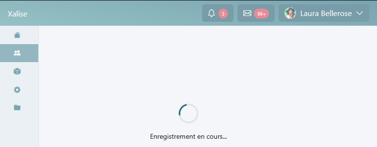
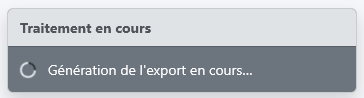
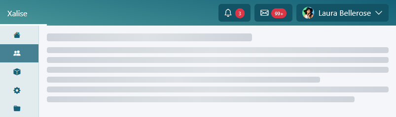
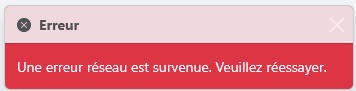
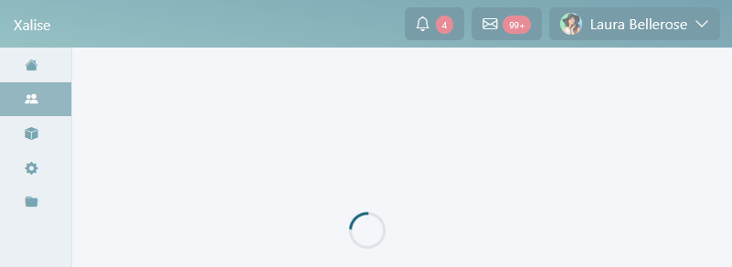
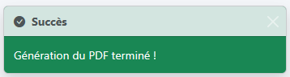
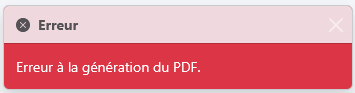
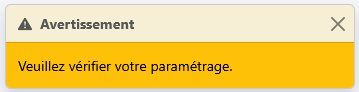
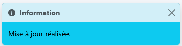
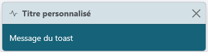

<div align="center">

# Xalise — JavaScript Toolkit

 

</div>

## 1. Présentation

Xalise définit un ensemble de modules JavaScript conçus pour :
* Standardiser les appels HTPP.
* Centraliser les feedbacks utilisateur (toasts, loaders).
* Améliorer la lisibilité et la maintenabilité du code.

Le code doit être :
* Lisible → compréhensible sans effort.
* Cohérent → mêmes patterns partout.
* Prédictible → aucun comportement implicite.
* Documenté → via JSDoc strict décrit plus bas dans ce document.

Chaque module a une responsabilité unique et claire :
* `XalHttp` → gestion des appels HTPP.
* `XalToast` → feedback utilisateur.
* `XalLoaderOverlay` → blocage UI.
* `XalDialog` → modales, si applicables.

## 2. Coding Standards

#### 2.1 Règles de nommage

| Élément | Convention | Exemple |
| --- | --- | --- |
| Variables | camelCase | `userList` |
| Fonctions | camelCase : verbe + intention | `fetchUsers()` |
| Paramètres | camelCase | `dialogOptions` |
| Constantes| UPPER_SNAKE_CASE | `DEFAULT_DELAY` |
| Callbacks | Préfixé avec `on` | `onSuccess`, `onError` |

#### 2.2 Structure des fonctions

```js
function fetchUsers(requiredParam, { optionnalParam, onSuccess, onError } = {}) {}
```

* Paramètres obligatoires en premier.
* Objet `options` en dernier.
* Callbacks dans `options`.

#### 2.3 Formatage

* Indentation : 4 espaces.
* Lignes ≤ à 100 caractères.
* Blocs toujours explicites.

```js
if (condition) {
    doSomething();
}
```

## 3. Documentation JSDoc

Les commentaires sont obligatoires pour :
* Les fonctions, peut importe leur portée (`public` ou `private`).
* Les modules.
* Les objets complexes.
* Les constantes.

#### 3.1 Template standard

```js
/**
 * Description courte
 *
 * Description complémentaire si nécessaire
 *
 * @public / @private
 *
 * @param {Type}                    paramName                              Description
 * @param {Type}                    [optionalParam=defaultValue]           Description
 *
 * @param {Object}                  [options={}]                           Description
 * @param {Type}                    [options.requiredProp]                 Description
 * @param {Type}                    [options.optionnalProp=defaultValue]   Description
 * @param {(arg: Type) => void}     [options.onSuccess]                    Callback succès
 * @param {(error: Error) => void}  [options.onError]                      Callback erreur
 *
 * @returns {ReturnType} Description
 *
 * @throws {TypeError}  Si paramètres invalides
 * @throws {Error}      Si erreur d'exécution
 */
```

#### 3.2 Fonction asynchrone

```js
/**
 * Description courte
 *
 * Description complémentaire si nécessaire
 *
 * @public / @private
 *
 * @param {Type}                    paramName                              Description
 * @param {Type}                    [optionalParam=defaultValue]           Description
 *
 * @param {Object}                  [options={}]                           Description
 * @param {Type}                    [options.requiredProp]                 Description
 * @param {Type}                    [options.optionnalProp=defaultValue]   Description
 * @param {(arg: Type) => void}     [options.onSuccess]                    Callback succès
 * @param {(error: Error) => void}  [options.onError]                      Callback erreur
 *
 * @returns {Promise<Type>} Description
 *
 * @throws {TypeError}  Si paramètres invalides
 * @throws {Error}      Si erreur d'exécution
 */
```

#### 3.3 Typedef (objet complexe)

```js
/**
 * @typedef {Object} EntityOptions                      Description
 *
 * @property {string}                   id              Identifiant
 * @property {string}                   name            Nom
 * @property {boolean}                  [enabled=true]  `true` si actif, sinon `false`
 * @property {string[]}                 [tags=[]]       Liste de tags
 *
 * @property {(data: any) => void}      [onSuccess]     Callback succès
 * @property {(error: Error) => void}   [onError]       Callback erreur
 */
 ```

 #### 3.4 Constante

```js
/**
 * Description
 * 
 * @public / @private
 *
 * @type {Type}
 */
const CONSTANT = value;
 ```

#### 3.5 Module / namespace

```js
/**
 * Nom du module
 *
 * Description globale
 *
 * @requires ModuleName
 * @requires ModuleName
 *
 * @namespace ModuleName
 */
 ```

## 4. XalHttp — Appels Ajax

Le module implémente une surcouche de la méthode native `fetch()` utilisée pour les appels Ajax. Celle-ci gère automatiquement les indicateurs visuels de chargement et les erreurs HTTP.

La méthode native `fetch()` ne doit jamais être utilisée directement, toutes les demandes doivent passer par `XalHttp`. Il est nécessaire de toujours gérer `onError` ou un fallback.

```js
XalHttp.fetch(
    url,
    fetchOptions,
    { placeholder, toast, overlay, onError, onSuccess, errorMessages }
)
```

| Paramètre | Type | Défaut | Description |
|---|---|---|---|
| `url` | `string` | — | URL de la ressource demandée. |
| `fetchOptions` | `Object` | `{}` | Options passées à `fetch()` (`method`, `headers`, `body`, etc.). |
| `indicators` | `Object` | `{}` | |
| `indicators.placeholder` | `string` | — | Sélecteur CSS de la zone où afficher le placeholder. |
| `indicators.toast` | `string` | — | Message du toast de chargement. Si renseigné, le toast est affiché. |
| `indicators.overlay` | `boolean` | `false` | Si `true`, affiche l'overlay sans message. |
| `indicators.overlay` | `string` | — | Si `string`, affiche l'overlay avec le message indiqué. |
| `indicators.onSuccess` | `Function` | — | Callback appelé après une réponse HTTP réussie. Reçoit la `Response` en paramètre. |
| `indicators.onError` | `Function` | — | Callback appelé en cas d'erreur réseau ou HTTP. Reçoit la `Response` (erreur HTTP) ou une `Error` (erreur réseau). Si non renseigné, un toast d'erreur générique est affiché. |
| `indicators.errorMessages` | `Record<number, string>` | — | Messages d'erreur personnalisés par statut HTTP. |

### 4.1 Exemples d'utilisation de `fetch()`

#### 4.1.2 Chargement d'une liste 

L'appel ci-dessous insère un placeholder dans le container `#xal-id-table-fournisseurs` pendant le traitement. Il est automatiquement retiré à la fin du traitement.

```js
XalHttp.fetch(
    '/api/fournisseurs',
    {},
    {
        placeholder: '#xal-id-table-fournisseurs',
        onSuccess: (response) => {
            response.json().then(data => {
                renderTable(data.items);
                document.querySelector('#xal-id-counter').textContent = data.total;
            });
        },
    });
```

#### 4.1.2 Chargement avec paramètres de recherche  

L'appel ci-dessous déclenche l'affichage d'une barre de progression à statut indéterminé sous la barre de navigation principale pendant le traitement. Cette barre de progression est automatiquement masquée à la fin du traitement.

```js
const params = new URLSearchParams({ search: 'dupont', page: 1, limit: 20 });

XalHttp.fetch(
    `/api/fournisseurs?${params}`,
    {}, 
    {
        onSuccess: (response) => {
            response.json().then(data => renderTable(data.items));
        },
    });
```

#### 4.1.3 Création d'un enregistrement 

```js
XalHttp.fetch(
    '/api/fournisseurs',
    {
        method:  'POST',
        headers: { 'Content-Type': 'application/json' },
        body:    JSON.stringify({ nom: 'Dupont', siret: '12345678900000' }),
    },
    {
        overlay:   'Enregistrement en cours…',
        onSuccess: (response) => {
            response.json().then(data => {
                XalToast.success(`Fournisseur "${data.nom}" créé avec succès.`);
            });
        },
        onError: (error) => {
            if (error instanceof Response && error.status === 409) {
                XalToast.warning('Un fournisseur avec ce SIRET existe déjà.');
            } else {
                XalToast.error('Impossible de créer le fournisseur.');
            }
        },
    });
```



#### 4.1.4 Mise à jour d'un enregistrement  

```js
XalHttp.fetch(
    '/api/fournisseurs/42',
    {
        method:  'PUT',
        headers: { 'Content-Type': 'application/json' },
        body:    JSON.stringify({ nom: 'Dupont & Fils' }),
    },
    {
        overlay:   'Mise à jour en cours…',
        onSuccess: () => XalToast.success('Fournisseur mis à jour avec succès.'),
        onError:   () => XalToast.error('Impossible de mettre à jour le fournisseur.'),
    });
```

#### 4.1.5 Suppression avec surcharge des messages des statuts HTTP 

```js
XalHttp.fetch(
    '/api/fournisseurs/42',
    { method: 'DELETE' },
    {
        overlay: 'Suppression en cours…',
        onSuccess: () => {
            XalToast.success('Fournisseur supprimé avec succès.');
            document.querySelector('#xal-id-row-42')?.remove();
        },
        errorMessages: {
            404: 'Ce fournisseur n\'existe plus.',
            409: 'Ce fournisseur est lié à des commandes existantes.',
        },
    });
```

#### 4.1.6 Upload de fichier 

```js
const formData = new FormData();
formData.append('fichier', document.querySelector('#xal-id-input-fichier').files[0]);

XalHttp.fetch(
    '/api/import', 
    { method: 'POST', body: formData },
    {
        overlay: 'Import en cours…',
        onSuccess: (response) => {
            response.json().then(data => {
                XalToast.success(`${data.imported} enregistrement(s) importé(s).`);

                if (data.skipped > 0) {
                    XalToast.warning(`${data.skipped} enregistrement(s) ignoré(s).`);
                }
            });
        },
        onError: () => XalToast.error('L\'import a échoué. Vérifiez le format du fichier.'),
    });
```

#### 4.1.7 Téléchargement d'un fichier 

```js
XalHttp.fetch(
    '/api/export/fournisseurs',
    {},
    {
        toast: 'Génération de l\'export en cours…',
        onSuccess: (response) => {
            response.blob().then(blob => {
                const url  = URL.createObjectURL(blob);
                const link = document.createElement('a');

                link.href     = url;
                link.download = 'fournisseurs.xlsx';
                link.click();

                URL.revokeObjectURL(url);
                XalToast.success('Export téléchargé avec succès.');
            });
        },
        onError: () => XalToast.error('Impossible de générer l\'export.'),
    });
```



### 4.2 Mock des appels Ajax

La méthode `mock()` simule un appel HTTP avec un délai configurable et une réponse fictive. Elle déclenche les mêmes indicateurs visuels que `XalHttp.fetch()`.

```js
XalHttp.mock(
    data,
    { delay, fail },
    { placeholder, toast, overlay, onError, onSuccess, errorMessages }
)
```

| Paramètre | Type | Défaut | Description |
|---|---|---|---|
| `data` | `*` | `null` | Données fictives retournées par la promesse |
| `delay` | `number` | `5000` | Délai en ms avant la résolution |
| `fail` | `boolean` | `false` | Si `true`, simule une erreur réseau |
| `indicators` | `Object` | `{}` | |
| `indicators.placeholder` | `string` | — | Sélecteur CSS de la zone où afficher le placeholder. |
| `indicators.toast` | `string` | — | Message du toast de chargement. Si renseigné, le toast est affiché. |
| `indicators.overlay` | `boolean` | `false` | Si `true`, affiche l'overlay sans message. |
| `indicators.overlay` | `string` | — | Si `string`, affiche l'overlay avec le message indiqué. |
| `indicators.onSuccess` | `Function` | — | Callback appelé après une réponse HTTP réussie. Reçoit la `Response` en paramètre. |
| `indicators.onError` | `Function` | — | Callback appelé en cas d'erreur réseau ou HTTP. Reçoit la `Response` (erreur HTTP) ou une `Error` (erreur réseau). Si non renseigné, un toast d'erreur générique est affiché. |
| `indicators.errorMessages` | `Record<number, string>` | — | Messages d'erreur personnalisés par statut HTTP. |

#### 4.2.1 Succès avec délai par défaut (5s)

```js
XalHttp.mock({ items: [], total: 0 });
```

#### 4.2.2 Succès avec placeholder et délai personnalisé

```js
XalHttp.mock(
    [{ id: 1, nom: 'Dupont' }, { id: 2, nom: 'Martin' }],
    { delay: 10000 },
    { placeholder: '#tooltip-div' }
);
```



#### 4.2.3 Simulation d'erreur réseau

```js
XalHttp.mock(null, { fail: true })
       .catch(err => console.error(err.message));
```



#### 4.2.4 Simulation d'une opération longue avec toast

Le toast est affiché dans le coin inférieur droit de la page.

```js
XalHttp.mock(
    { url: '/exports/rapport-2026.pdf' },
    { delay: 20000 },
    { toast: 'Génération de l\'export en cours…' }
);
```


#### 4.2.5 Overlay bloquant toute interaction avec la page

```js
// Sans message
XalHttp.mock(
    { url: '/exports/rapport-2026.pdf' },
    { delay: 20000 },
    { overlay: true }
);
```



```js
// Avec message
XalHttp.mock(
    { url: '/exports/rapport-2026.pdf' },
    { delay: 20000 },
    { overlay: 'Enregistrement en cours…' }
);
```


Le message de l'overlay peut être mis à jour en cours d'opération.

```js
XalHttp.mock(
    { url: '/exports/rapport-2026.pdf' },
    { delay: 20000 },
    {
        overlay: 'Initialisation…',
        onSuccess: (data) => {
            XalLoaderOverlay.setMessage('Finalisation…');
        }
    }
);
```

## XalToast — Toasts de feedback

Affiche des toasts Bootstrap contextuels pour informer l'utilisateur du résultat d'une opération. Ceux-ci sont affichés dans le coin inférieur droit de la page.

```js
XalToast.success(message, allowHtml, delay)
XalToast.error(message, allowHtml, delay)
XalToast.warning(message, allowHtml, delay)
XalToast.info(message, allowHtml, delay)
```

| Paramètre | Type | Défaut | Description |
|---|---|---|---|
| `message` | `string` | — | Message à afficher dans le corps du toast. |
| `options` | `Object` | `{}` | Options d'affichage du toast. |
| `[options.allowHtml]` | `boolean` | `false` | Si `true`, le message est interprété comme du HTML, sinon comme du texte brut. |
| `[options.delay]` | `number` | `5000` | Délai en ms avant masquage automatique. |

#### 4.1 Toast de succès

```js
XalToast.success('Fournisseur créé avec succès.');
```



#### 4.2 Toast d'erreur

```js
XalToast.error('Une erreur est survenue. Veuillez réessayer.');
```



#### 4.3 Toast d'avertissement

```js
XalToast.warning('Ce fournisseur est lié à des commandes existantes.');
```



#### 4.4 Toast d'information

```js
XalToast.info('Les données ont été mises à jour.');
```



#### 4.5 Délai personnalisé

```js
// Toast affiché pendant 10 secondes
XalToast.success('Export généré avec succès.', { delay: 10000 });

// Toast affiché pendant 2 secondes
XalToast.info('Recherche en cours…', { delay: 2000 });
```

#### 4.6 Toast personnalisé

```js
XalToast.custom( 
    { 
        title: 'Titre personnalisé', 
        icon: 'bi-activity', 
        color: 'text-bg-xalise', 
        message: 'Message du toast' 
    }
);
```

| Paramètre | Type | Défaut | Description |
|---|---|---|---|
| `options.title` | `string` | — | Message à afficher dans le titre du toast. |
| `options.icon` | `string` | — | Classe de l'icône à afficher dans le titre du toast. |
| `options.color` | `string` | — | Classe de la couleur de fond. |
| `options.message` | `string` | — | Message à afficher dans le corps du toast. |
| `delay` | `number` | `5000` | Délai en ms avant masquage automatique. |



